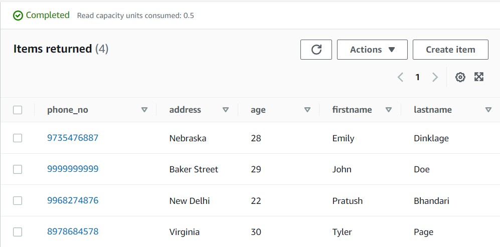

# TASK 2 - INE (SDE)

## Overview

This is a React SPA, where user can search for the user stored in DynamoDB and the results for the same will be shown beneath it

## Tech Stack

- React
- Node.js (For AWS Lamda)
- DynamoDB

## Clone the project


## Run the project 

```bash
cd client
npm start
```

Open [http://localhost:3000](http://localhost:3000) to view it in your browser.

## What to search 

The input field takes customer phone number as an input. As of the DynamoDB table contains the following data:



Search for any of the phone numbers and it will their details